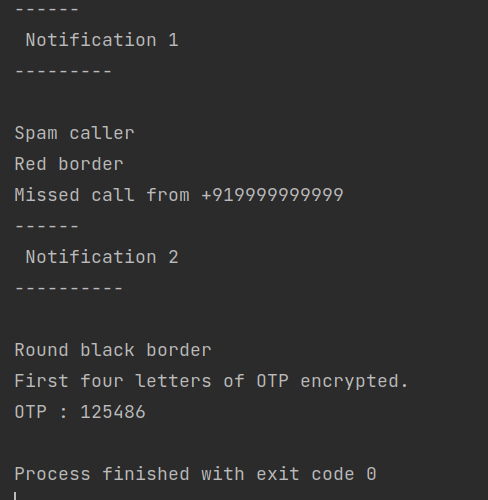

### The "Decorator" Structural Design Pattern

The Decorator (Structural) Design Pattern is used when additional implementation has to be added around the original implementation, without altering the original implementation directly. We do this by wrapping the original method inside a "Wrapper" class which "decorates" the original implementation.

#### Problem Statement

Before installing TrueCaller, a phone has Custom UI tools to represent notifications on missed calls and messages. After TrueCaller is installed, we do not want the phone's implementation of notifications to be changed, just to adapt to the UI and notification tones of truecaller.

To do this, we add a TrueCallerNotificationDecorator class that adds it decoration, and calls the original method "notifyUser" inside its method, hence, decorating the actual implementation.

#### Output

It may be seen in the output below, that the original notification has been surrounded by UI details, hence, the actual implementation has been decorated without changing its implementation.

#### Resources
[Refactoring Guru : Decorator](https://refactoring.guru/design-patterns/decorator)